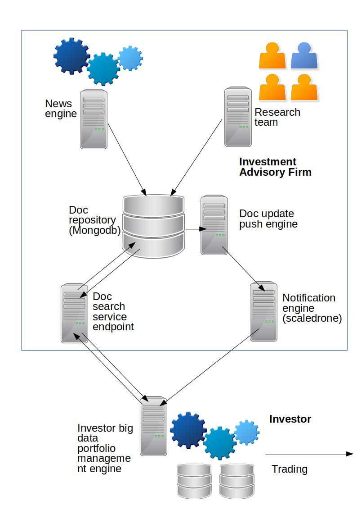

investadvicepublisher
=====================
This repository demonstrates a platform to publish json based investment advices/research. Extraction can be done in restapi

Background
-----------
Investors are now facing a lot of market information and a lot of them are unstructured. Many investors are going to build up BigData centric research models to support more efficient investment decision activities. Structured market information and tagged based documents can help investors to select relevant market information effectively. As an investment advisory firm/research institute, providing attribute based documents will be more useful than text based documents because investors rely more on machine to analyze investment advices.

In order to publish documents, websocket based solution and API based document enquiry will be important here. Therefore this project comes out.

Architecture
------------
- MongoDB as a datastore of reports and news
- News and Research Report Publisher store json based documents in MongoDB
- MongoDB change stream push news to ScaleDrone (cloud based message publisher)
- Investors can connect to ScaleDrone to receive update messages
- Investors can browse report data (in json format) through Doc Retrieval Service Endpoint

Prerequsite
------------
- linux/unix/mac
- mongodb 3.6 or above
- scala 2.12.x
- sbt

Setup
-----
- init mongodb: cd mongodb; ./mongostart.sh
- init replicaSet: login to mongodb and run rs.initiate()
(detail pls refer to: https://docs.mongodb.com/manual/reference/method/rs.initiate/ )
- setup scaledrone account and get a channel id
(detail pls refer to: https://www.scaledrone.com)
- create a file called channelid under mongodb folder and put the scaledrone channel id to that file (without any leading space)
- sbt build: cd investadvicereqres; sbt clean compile 

Run
---
- start mongodb: cd mongodb; ./mongostart.sh
- start mongodb change stream: cd mongodb; ./mongostream.sh
- push news: cd mongodb; ./monitorandpush.sh
- start doc retrieval service: cd investadvicereqres; sbt run
- client: open browser and browse file: client/scaledroneclient.htm?channel=<channelid>
